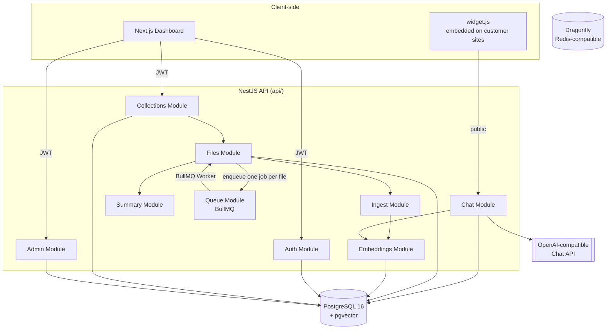
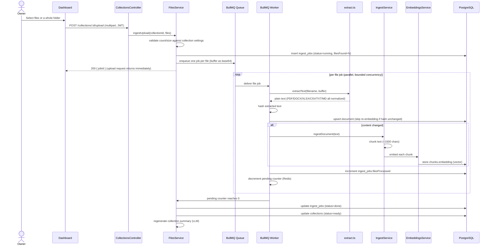
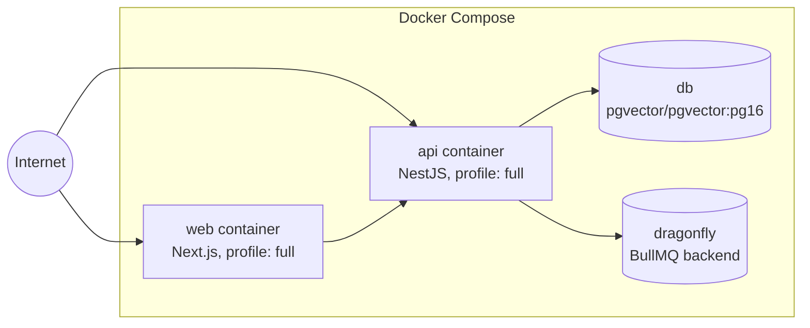

# Architecture

## Two independent apps

`api/` and `web/` are separate Node projects, each with its own
`package.json`, lockfile, and `node_modules`. They only communicate over
HTTP — there is no shared TypeScript package or monorepo tooling (aside from
a `pnpm-workspace.yaml` used solely to allowlist native build scripts).

| App | Framework | Responsibility |
|---|---|---|
| `api/` | NestJS + Drizzle ORM | Auth, collection management, file ingestion, embeddings, chat/RAG, admin |
| `web/` | Next.js 15 (App Router) | Owner-facing dashboard: create collections, upload files/folders, view conversations |

The **chat widget** (`api/src/public/widget.js`) is a third, much smaller
runtime: a dependency-free vanilla JS script served directly by the API and
embedded on the *customer's* website, not on `web/`.

## Component map

## Request flow: uploading files into a collection

## Why a per-file BullMQ job

Each uploaded file becomes its own BullMQ job, mirroring how the predecessor
project (a website crawler) gave each discovered page its own job:

- **Concurrency is a Worker setting** (`INGEST_FILE_CONCURRENCY`, default 4),
  applied *globally* across all collections uploading at once.
- **Crashes are recoverable**: BullMQ persists jobs in Redis; a restarted API
  process resumes any files still queued instead of losing an in-memory queue.
- **Slow extractions don't block the request**: `ingestUpload()` returns a
  `jobId` immediately after validating and enqueueing; the actual PDF/DOCX
  parsing and embedding happen asynchronously in the Worker.
- **Finalization is a race-free counter**: uploading a batch of N files sets
  a Redis `pending` counter to N; every completed job (success *or*
  exhausted retries) decrements it. Whichever worker takes it to zero
  finalizes the `ingest_jobs` row and flips the collection back to `ready`.

Unlike the crawler this replaced, there's no discovery loop — the browser
already knows exactly which files it's sending, so the job count is fixed
up front rather than growing as new URLs are found.

See [Ingestion Pipeline](./ingestion-pipeline) for the full mechanics.

## Deployment topology

`db` and `dragonfly` run by default (`docker compose up -d db dragonfly`);
`api` and `web` are gated behind the `full` Compose profile, since local
development typically runs them directly with `pnpm dev` for fast reload.
The API container mounts a `modelcache` volume so the local embedding model
(downloaded from Hugging Face on first run) survives container rebuilds.

## Module responsibilities (`api/src/`)

| Module | Key files | Responsibility |
|---|---|---|
| `auth/` | `auth.service.ts`, `auth.guard.ts` | Register/login, JWT issuance, password reset |
| `collections/` | `collections.service.ts`, `collections.controller.ts` | CRUD for collections, settings, origins, upload endpoint |
| `files/` | `files.service.ts`, `extract.ts` | BullMQ worker, per-file-type text extraction, document upsert |
| `ingest/` | `chunker.ts`, `ingest.service.ts` | Text chunking and chunk persistence |
| `embeddings/` | `embedding-provider.ts`, `local-embedding.provider.ts`, `openai-embedding.provider.ts` | Pluggable embedding backends |
| `chat/` | `chat.service.ts`, `chat.controller.ts` | Hybrid retrieval, prompt construction, SSE streaming |
| `summary/` | `summary.service.ts` | LLM-generated one-paragraph collection summary |
| `admin/` | `admin.service.ts`, `admin.guard.ts` | Platform-operator views (Basic Auth, separate from user JWT) |
| `queue/` | `queue.module.ts`, `bull-board.module.ts` | BullMQ queue wiring, Bull Board UI |
| `mail/` | `mail.service.ts` | SMTP password-reset emails |
| `usage/` | `usage.service.ts` | Token/cost accounting per collection |
