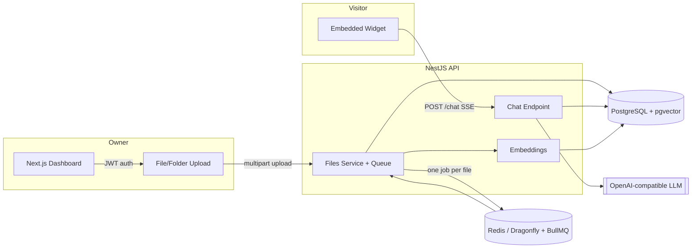

# DocuBot — Technical Documentation

DocuBot turns your own documents into a RAG-powered chatbot: upload files or
an entire folder, it extracts and indexes their content in PostgreSQL with
`pgvector`, and serves an embeddable chat widget that answers visitor
questions using only that content.

This folder documents the system for engineers picking up the codebase —
architecture, data model, request flows, and operational concerns.

## Contents

| Doc | Covers |
|---|---|
| [Architecture](./architecture.md) | System overview, component responsibilities, deployment topology |
| [Data Model](./data-model.md) | Database schema, entity relationships, cascades |
| [Ingestion Pipeline](./ingestion-pipeline.md) | How an upload becomes searchable text and embeddings |
| [RAG Pipeline](./rag-pipeline.md) | How a chat question becomes a grounded, cited answer |
| [API Reference](./api-reference.md) | HTTP endpoints, auth, rate limits |
| [Security](./security.md) | Threat model and the specific mitigations in code |
| [Frontend](./frontend.md) | Next.js dashboard structure and key flows |
| [Setup Guide](./setup.md) | Local development and Docker deployment |

## At a glance

**Stack:** NestJS + Drizzle ORM (API) · Next.js 15 (dashboard) · PostgreSQL 16 +
pgvector · Redis-compatible Dragonfly + BullMQ (per-file ingestion queue) ·
local `multilingual-e5-small` embeddings via transformers.js, with an
OpenAI-compatible provider for chat completions · `pdf-parse` / `mammoth` /
`xlsx` for text extraction from PDF, DOCX, and spreadsheet files.
