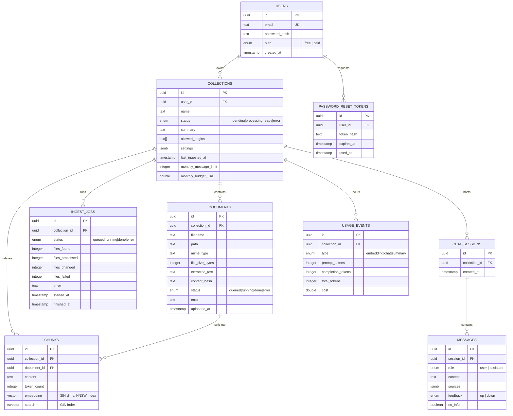

# Data Model

PostgreSQL 16 with the `pgvector` extension, managed through Drizzle ORM
(`api/src/db/schema.ts`). All tables use UUID primary keys and cascade
deletes downward from `users`.

## Entity-relationship diagram

## Notable design choices

**Cascading deletes everywhere.** Every foreign key uses
`onDelete: 'cascade'`. Deleting a `user` deletes every `collection` they
own, which in turn deletes its `documents`, `chunks`, `ingest_jobs`,
`chat_sessions`, and `messages`. There is no soft-delete layer — this is a
deliberate simplicity trade-off suited to a single-tenant-per-owner model.

**`chunks.embedding` is a 384-dimension vector** (`EMBEDDING_DIM` in
`schema.ts`), matching the local `multilingual-e5-small` model's output size.
Switching to the OpenAI embedding provider (`text-embedding-3-small`, 1536
dims by default) would require a schema migration to change the vector
column's dimensionality — the codebase is currently pinned to 384.

**Two indexes on `chunks` power hybrid retrieval:**
- `chunks_embedding_idx`: an **HNSW** index using `vector_cosine_ops`, for
  fast approximate nearest-neighbor search over embeddings.
- `chunks_search_idx`: a **GIN** index over a generated `tsvector` column,
  for PostgreSQL full-text (lexical) search.

Both are queried per chat request and merged via Reciprocal Rank Fusion — see
[RAG Pipeline](./rag-pipeline.md).

**`collections.settings` is a typed JSONB blob** (`CollectionSettings`), not
normalized columns — widget color, greeting, custom system-prompt addendum,
LLM temperature, and upload limits (`maxFiles`, `maxFileSizeMb`) all live
there with defaults in `DEFAULT_SETTINGS`. This avoids a migration for every
new per-collection knob at the cost of losing column-level constraints.

**`documents.path` preserves folder structure.** When a user uploads an
entire folder via the browser's directory picker, each file carries its
`webkitRelativePath` (e.g. `policies/2024/handbook.pdf`), stored verbatim in
`path`. A loose single-file upload just uses the filename. The unique index
`documents_collection_path_idx` is on `(collection_id, path)`, so
re-uploading the same relative path updates the existing document instead of
creating a duplicate.

**`documents.content_hash`** is a hash of the *extracted* text (not the raw
file bytes). Re-uploading a file whose extracted content is unchanged skips
re-ingestion (re-embedding) entirely — useful when a PDF is re-exported with
different metadata but identical text.

**`messages.no_info`** is set when the LLM's answer matches one of the
"I don't know" phrase markers (`isNoInfoAnswer` in `chat.service.ts`). This
flag drives the admin dashboard's visibility into answer quality without
requiring a separate classification call.

**`ChatSource` carries `filename`/`path`, not a URL.** Unlike a crawled web
page, an uploaded document has no public address to link to — a chat
citation names the source file instead of linking to it (see
`api/src/public/widget.js`, which renders sources as plain labels).
