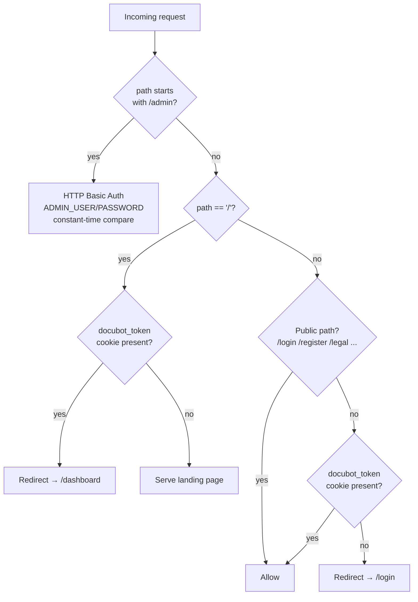

# Frontend (`web/`)

Next.js 15, App Router, server components by default with server actions for
mutations (`web/app/actions.ts`) instead of a separate client-side API
layer. No client-side state management library — data is fetched
server-side and passed down as props.

## Routing & access control



`web/middleware.ts` runs on every request (matcher excludes static assets).
Two independent guards live here:

1. **`/admin*`** uses HTTP Basic Auth against `ADMIN_USER`/`ADMIN_PASSWORD`
   — entirely separate from the dashboard's own session, since it's the
   platform operator's view, not a collection owner's. Credentials are
   compared with a constant-time `safeEqual()` to avoid leaking which field
   is wrong via response timing.
2. **Everything else** checks for the `docubot_token` cookie (set on
   login/register via a server action). Authenticated users hitting `/` are
   redirected straight to `/dashboard`; everyone else hitting a
   non-public route without the cookie is redirected to `/login`.

## Directory structure

```
web/app/
├── page.tsx                          # Public landing page
├── login/, register/,
│   forgot-password/, reset-password/ # Public auth flows
├── legal/                            # Terms, privacy, cookies, DPA
├── dashboard/
│   ├── page.tsx                      # Collection list + create-by-name form
│   └── collections/[id]/
│       ├── page.tsx                  # Collection detail: status, settings, upload, embed snippet
│       ├── preview/page.tsx          # Live chat preview against the collection's indexed documents
│       └── conversations/
│           ├── page.tsx              # Conversation list
│           └── [sessionId]/page.tsx  # Full transcript + feedback
├── admin/                            # Operator-only (Basic Auth)
│   ├── page.tsx                      # Cross-tenant overview
│   ├── collections/page.tsx
│   └── users/page.tsx
├── api/collections/[id]/documents/[documentId]/  # Route handler (proxies a document fetch)
└── actions.ts                        # Server actions: login, create collection, upload files, etc.

web/components/
├── ui/                                # Design-system primitives (Button, Card, Table, Alert, ...)
├── ChatPlayground.tsx                 # In-dashboard chat tester (calls /chat like the real widget)
├── UploadForm.tsx                     # Client component: builds FormData from file/folder pickers, calls uploadFilesAction
├── IngestProgress.tsx                 # Shows ingest job / collection processing status
├── DocumentDetailModal.tsx            # Document row + detail modal; view extracted text, delete the document
├── AppFooter.tsx / legal/LegalPage.tsx
└── WidgetEmbed.tsx                    # Renders the copy-paste embed snippet

web/lib/
├── api.ts                             # Typed fetch wrappers + shared types mirroring the API's DTOs
├── format.ts                          # Date/number/byte-size formatting
├── markdown.ts                        # Minimal Markdown → HTML for chat rendering
└── cn.ts                              # className merge utility
```

## Server actions instead of a client API layer

`web/app/actions.ts` exports `'use server'` functions
(`createCollectionAction`, `uploadFilesAction`, `loginAction`, ...) called
directly from form submissions and buttons. This keeps API calls, cookie
handling, and redirects server-side, and avoids exposing the API's bearer
token to client-side JavaScript at all — the JWT lives only in the
`docubot_token` HTTP cookie, read server-side in `lib/api.ts`.

`lib/api.ts` distinguishes two base URLs:

- `PUBLIC_API_URL` (`NEXT_PUBLIC_API_URL`) — used by client components that
  need to hit the API directly (e.g. the chat widget preview).
- `SERVER_API_URL` (`API_URL`, falling back to the public URL) — used by
  server components/actions, allowing the Docker Compose setup to route
  server-to-server calls over the internal Docker network
  (`http://api:3001`) while the browser still talks to `localhost:3001`.

## Uploading files or a folder

`UploadForm.tsx` is a client component with two file inputs: a plain
`<input type="file" multiple>` for loose files, and a second
`<input type="file" webkitdirectory multiple>` for submitting an entire
folder at once. On submit it builds a `FormData` where each selected `File`
is appended under the key `"files"`, alongside a matching `"paths"` entry
carrying that file's relative path — `file.webkitRelativePath` for the
folder picker, or just `file.name` for loose files. This `FormData` is
handed to `uploadFilesAction(collectionId, formData)`
(`app/actions.ts`), a server action that forwards it as a multipart request
to `POST /collections/:id/upload`.

Because uploads are a bounded, already-known-size batch (unlike the
predecessor project's open-ended website crawl), the UI doesn't need live
per-file progress polling — it shows a busy state during the upload/ingest
call and refreshes the document list afterward, with `IngestProgress`
reflecting the collection's `status` (`pending` → `processing` → `ready`).

## Deleting a document

Each row in the documents table (and the detail modal opened from it,
`DocumentDetailModal.tsx`) has a **Delete** button. It's a client component
that confirms via `window.confirm()`, then calls the `deleteDocumentAction`
server action, which forwards to `DELETE
/collections/:id/documents/:documentId` and calls `router.refresh()` on
success. The API deletes the `documents` row and its `chunks` cascade at the
database level (see [Data Model](./data-model.md)) — no separate cleanup
call is needed to remove the document from the RAG index.

## Chat playground

`ChatPlayground.tsx` lets a collection owner test their bot from inside the
dashboard by calling the exact same public `/chat` endpoint the embedded
widget uses, with the same SSE streaming. Since uploaded documents have no
public URL, cited sources are rendered as inert filename tags rather than
links — the same visual pattern the widget itself uses
(`api/src/public/widget.js`'s `addSources()`).

## The embeddable widget is not part of the Next.js app

`api/src/public/widget.js` is a standalone, dependency-free vanilla
JavaScript file served by the **API**, not built or bundled by Next.js. It
renders its own chat bubble UI, manages a `docubot:session:<collectionId>`
key in `localStorage` to persist the session ID across page loads, and
calls `/chat` directly with SSE. Collection owners embed it with a single
`<script>` tag carrying `data-collection-id`; it has no build step or
framework dependency, keeping the snippet copy-pasteable into any site
regardless of that site's own stack.
