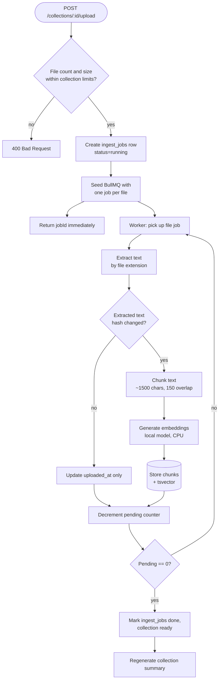

# Ingestion Pipeline

Source: `api/src/files/`, `api/src/ingest/`, `api/src/embeddings/`.

## Overview

## Accepting the upload

`CollectionsController.upload()` receives a multipart request built by the
dashboard's upload form: each selected file arrives as a `files` field, with
a matching `paths` field carrying its relative path
(`file.webkitRelativePath` for a folder upload via the browser's directory
picker, or just the filename for loose files). `FilesInterceptor` (from
`@nestjs/platform-express`, backed by `multer`) parses these into
`Express.Multer.File[]` in memory — nothing touches disk on the API side.

`FilesService.ingestUpload()` validates the batch against the collection's
own settings before accepting anything:

- **File count** — rejected if it exceeds `settings.maxFiles` (default 200).
- **Per-file size** — rejected if any file exceeds `settings.maxFileSizeMb`
  (default 100MB). The controller also enforces a hard server-side ceiling
  independent of any collection's configured limit.
- **File type** — rejected if any file's extension isn't one of the
  supported formats (`isSupportedFile()` in `files/extract.ts`).

Only after every file in the batch passes validation does anything get
written to the database or queued — an oversized file anywhere in the batch
fails the whole request rather than partially ingesting.

## Text extraction by file type

`extractText()` (`files/extract.ts`) dispatches on file extension:

| Extension | Library | Notes |
|---|---|---|
| `.pdf` | `pdf-parse` | Deferred-imported: not loaded unless a PDF is actually being processed |
| `.docx` | `mammoth` | `extractRawText()` — strips formatting, keeps paragraph structure |
| `.xlsx`, `.xls`, `.csv` | `xlsx` (SheetJS) | Each sheet is rendered as its own `## SheetName` block of CSV-formatted rows |
| `.txt`, `.md`, `.markdown` | — | Read directly as UTF-8 text |

Every branch normalizes its format into plain text with blank-line-separated
blocks, which is exactly what `chunkText()` expects — a spreadsheet's
multiple sheets, for instance, become clearly labeled sections rather than
one undifferentiated blob of comma-separated values.

## Chunking

`chunkText()` (`ingest/chunker.ts`) splits on blank-line/paragraph
boundaries first (so a chunk doesn't cut a sentence or a spreadsheet row in
half), then hard-wraps any oversized paragraph at `maxChars` (default 1500)
with an `overlap` character tail carried into the next chunk (default 150).
Chunks under 40 characters are discarded as noise. This is deliberately
format-agnostic — the same function chunks a PDF's prose and a CSV's rows,
since both have already been normalized to plain text by the extraction
step above.

## Embedding

Two interchangeable providers implement `EmbeddingProvider`
(`embeddings/embedding-provider.ts`):

| Provider | Model | Dimensions | Cost |
|---|---|---|---|
| `local` (default) | `Xenova/multilingual-e5-small` via transformers.js | 384 | Free, runs on CPU |
| `openai` | `text-embedding-3-small` (configurable) | 1536 by default | Per-token, requires `OPENAI_API_KEY` |

The active provider is selected by `EMBEDDING_PROVIDER` and resolved once at
module init (`embeddings.module.ts`). The database's `chunks.embedding`
column is fixed at 384 dimensions (`EMBEDDING_DIM` in `schema.ts`), so
switching to the OpenAI provider's default dimensionality would require a
schema migration.

## Coordination via Redis, one job per file

Each uploaded file gets its own BullMQ job, processed by a Worker running
inside `FilesService` (`onModuleInit`). Unlike a crawl that discovers pages
progressively, an upload's file count is known in full up front — the
browser already sent everything — so coordination only needs a single
countdown:

| Key | Type | Purpose |
|---|---|---|
| `ingest:<jobId>:pending` | Counter | Files enqueued minus files completed for this batch |

**Finalization:** `ingestUpload()` sets the counter to the batch's file
count before enqueueing. Every `processFile()` exit path (success, or an
exhausted-retries failure caught by the Worker's `failed` handler)
decrements it via `decrementAndMaybeFinalize()`. The job that takes the
counter to `0` calls `finalize()`, which marks the `ingest_jobs` row `done`,
flips the collection to `ready`, and (if any file actually changed)
regenerates the collection summary.

**Retries:** each file job gets 2 attempts with exponential backoff
(`attempts: 2, backoff: { type: 'exponential', delay: 5_000 }`), matching
the crawler's original retry policy for a single page fetch — a transient
failure (e.g. a momentary embedding-provider hiccup) gets one automatic
retry before the file is counted as failed in `ingest_jobs.filesFailed`.

## Startup recovery

`StartupService` runs on boot and marks any `ingest_jobs` row still
`queued`/`running` as `error` — the per-batch `pending` counter lives in
Redis, which is wiped or stale after a restart mid-batch, so an interrupted
job has no way to resume or self-report completion. The owner sees the
collection flip to `error` and can simply re-upload the affected files.

## Deleting a document

`FilesService.removeDocument()` deletes a `documents` row directly (cascade
removes its `chunks`), letting an owner prune one file from a collection
without re-uploading everything else. There's no automatic "stale document"
reconciliation the way the old crawler had for pages that disappeared from
a site — an upload only ever adds or updates documents; removal is always
an explicit owner action.
